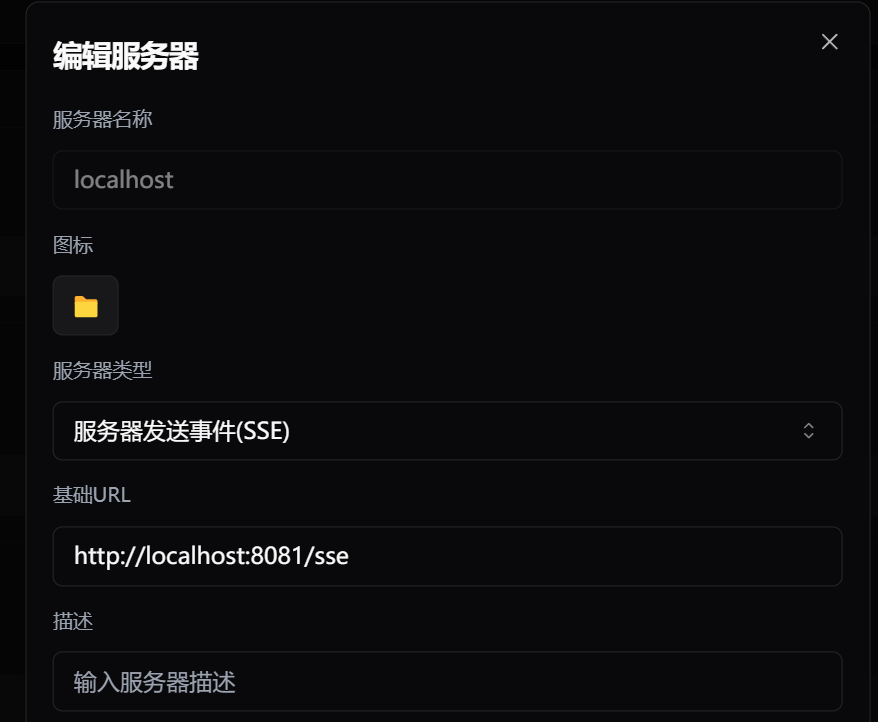
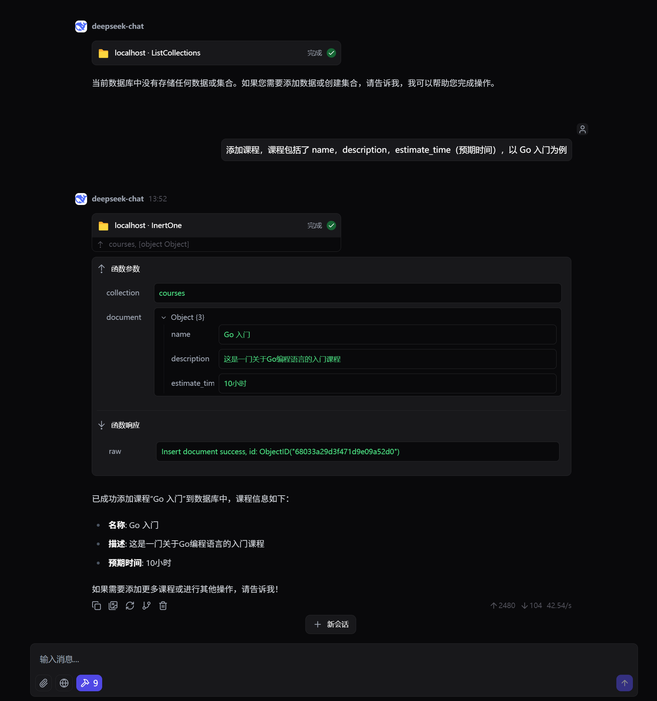
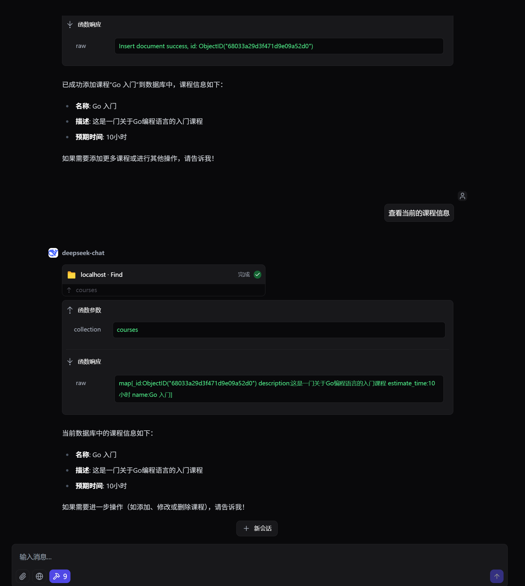

# MongoDB MCP Server

A Model Context Protocol (MCP) server that enables LLMs to connect MongoDB using [mcp-go](https://github.com/mark3labs/mcp-go). The server acts as a bridge between the LLM and the MongoDB database, allowing you to perform CRUD operations using natural language.

## Features

- **MongoDB action**: Query Collection, Document and Index
- **SSE Support**: Run MCP Server using Server-Sent Events (SSE)

## Available Tools

### Query Tools

- find: Query documents with filtering and projection
- Count: Count documents in a collection
- listCollections: List available collections
- insertOne: Insert a single document
- updateOne: Update a single document
- deleteOne: Delete a single document

### Index Tools
- createIndex: Create a new index
- dropIndex: Remove an index
- indexes: List indexes for a collection


## Configuration

> copy the `config.yml.example` file to `config.yml` and modify it according to your needs.

The server configuration is managed through the `config.yml` file. Below is an example configuration:

```yaml
mongo:
  host: mongodb
  port: 27017
  user: admin
  password: 123456
  database: db

mcp:
  name: mongo-mcp-server
  version: 1.0.0
  base_url: localhost:8081
  address: ":8081"
  sse: true
```

- **MongoDB Configuration**:
    - `host`: MongoDB server host.
    - `port`: MongoDB server port.
    - `user`: MongoDB username.
    - `password`: MongoDB password.
    - `database`: Target MongoDB database.

- **MCP Server Configuration**:
    - `name`: Name of the MCP server.
    - `version`: Version of the MCP server.
    - `base_url`: Base URL for the server.
    - `address`: Address and port for the server to listen on.
    - `sse`: Enable or disable SSE support, default is `true`.

## Usage

**Start the MCP Server**: Run the server using the following command:

 ```bash
 go run main.go
 ```

Use in DeepChat



## Example




## References

- [MongoDB Official Documentation](https://www.mongodb.com/zh-cn/docs/languages/go/)
- [mcp-go](https://github.com/mark3labs/mcp-go)
- [mongo-mcp](https://github.com/QuantGeekDev/mongo-mcp)
